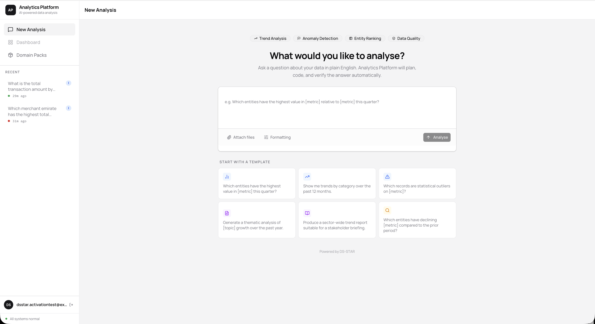
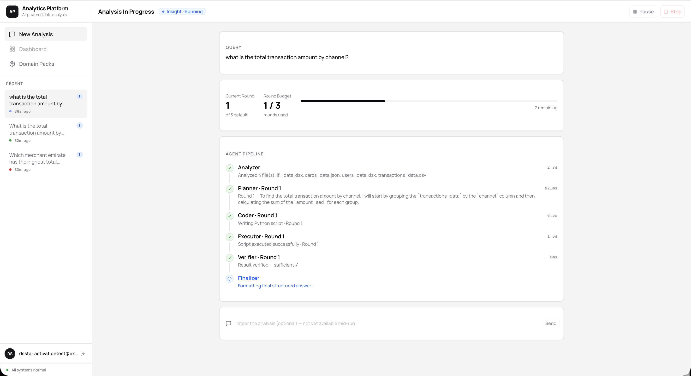
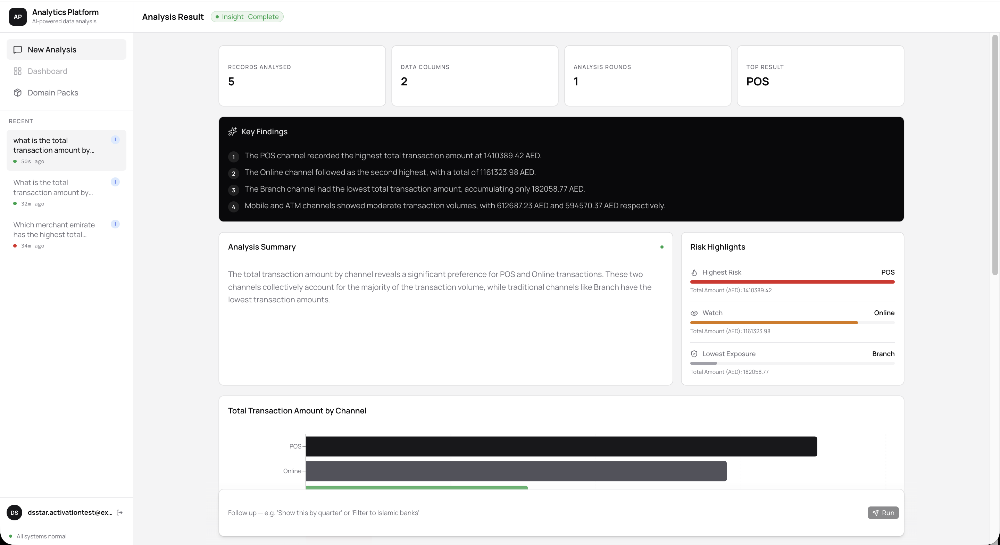

# DS-STAR

[](https://github.com/AzharuddinKazi/Agent-DASC/actions/workflows/ci.yml)
[](LICENSE)

DS-STAR turns a natural-language question about a dataset into an executable, self-correcting
data analysis pipeline. A user submits a query; a graph of specialized LLM agents plans an
analysis, writes Python to carry it out, runs that code in an isolated Docker sandbox, checks
whether the output actually answers the question, and iterates — re-planning or debugging —
until it does (or gives up after a bounded number of rounds). A genuinely ambiguous query gets
a clarifying-questions prompt before the pipeline even starts.

It also supports a second mode, **DS-STAR+ (report)**, which decomposes a broader question into
several sub-questions, runs the QA pipeline on each one, and has a Writer/Evaluator pair draft
and critique a combined, numbered-and-cited report (`[N]`) until it's judged complete — with an
optional human refine-vs-finalize checkpoint before it ships.

A task can be self-serve signed up for (Supabase Auth, per-user row scoping) and, once running,
stopped/paused/resumed cooperatively rather than only ever run to completion or killed outright.
A **domain pack** (browsable/downloadable in-app) can bias the whole pipeline's framing toward a
specific domain — e.g. fraud/AML — and ground its answers in uploaded reference documents via a
per-pack RAG knowledge base.

This repo is a monorepo: a Python/FastAPI backend that runs the agent graph, and a React
frontend that submits tasks and renders results.

<table>
<tr><td></td></tr>
<tr><td align="center"><em>Submitting a query</em></td></tr>
<tr><td></td></tr>
<tr><td align="center"><em>Watching the agent pipeline run in real time</em></td></tr>
<tr><td></td></tr>
<tr><td align="center"><em>Completed analysis: key findings, risk highlights, and a chart</em></td></tr>
</table>

```
DSStar/
├── backend/       FastAPI API + LangGraph agent pipeline — see backend/README.md
├── frontend/      React (Vite) SPA — see frontend/README.md
├── sandbox/       Docker image the backend spins up to execute generated scripts
├── specs/         Design specs: API contracts, agent prompts, DB schema, feature docs — some
│                  predate and differ from what was actually built (see TASKS.md), not all
│                  current
├── data/          Local datasets the pipeline reads (gitignored except data/test.csv)
├── docker-compose.yml   Runs backend + frontend together
└── TASKS.md       Live backlog / known issues, ranked by priority
```

## How it works

Every task runs as a state machine (LangGraph) over a single `TaskState` dict — no agent talks
to another directly, only through that shared state, checkpointed to Postgres (Supabase) after
every step so a task can resume if the process restarts.

**QA pipeline** (`task_type: "qa"`, the default):

```
analyzer → planner → coder → executor ─┬─(success)→ verifier ─┬─(sufficient)→ finalizer
                         ▲              └─(error, <2 retries)→ debugger → executor
                         │                                     │
                         └──────────────── router_agent ←──────┘ (insufficient, rounds left)
```

- **analyzer** — inspects the dataset(s) in `data/` and produces a short description of each.
- **planner** — given the accumulated plan so far, proposes the next analysis step in plain
  English (max 3 rounds per the DS-STAR paper).
- **coder** — turns the current plan step into a Python script.
- **executor** — runs that script inside the `dsstar-sandbox` Docker container (network-isolated,
  read-only data mount) and captures stdout/exit code.
- **debugger** — on a non-zero exit, patches the script from the traceback (up to 2 attempts)
  and sends it back to the executor.
- **verifier** — judges whether the latest output actually answers the query; if not and rounds
  remain, hands off to...
- **router_agent** — decides whether to add another plan step or backtrack, then loops to planner.
- **finalizer** — writes `final_result` and marks the task `completed` (or `failed` if the
  debugger ran out of attempts).

**Report pipeline** (`task_type: "report"`, DS-STAR+): a **question_generator** first breaks the
query into sub-questions; each runs through the QA loop above; a **sub_result_collector** stores
each answer and advances to the next sub-question; once all are done, a **writer** drafts a
report (citing each sub-analysis inline, `[N]`) and a **report_evaluator** critiques it —
looping through a **gap_question_generator** (which turns missing dimensions back into
sub-questions and re-enters the QA loop, its own citations labeled `[a]`, `[b]`... to distinguish
a refine round from the initial one) for up to `max_report_rounds` passes. If the task was
submitted with `require_human_review: true`, an insufficient-but-not-final-round verdict parks
the task at a **human_review_gate** checkpoint instead of auto-refining — a person decides
refine vs. finalize — before a **report_finalizer** stores the final report.

A running or paused task at any point in either pipeline can be stopped or paused/resumed
(`agents/cancellation.py`), checked cooperatively at every node boundary rather than killed
outright — an in-flight Docker sandbox run is force-killed rather than waited out.

Full agent-by-agent and API detail: [`backend/README.md`](backend/README.md). Frontend structure:
[`frontend/README.md`](frontend/README.md). Design specs (API contracts, prompts, DB schema):
[`specs/`](specs/) — some documents there are historical planning docs superseded by what was
actually implemented (e.g. `specs/agents/writer.md`'s checkpoint design differs from the
`human_review_gate`/`require_human_review` mechanism actually shipped); TASKS.md's "Completed"
section is the reliable record of current behavior.

## Prerequisites

- Python 3.12 and [uv](https://docs.astral.sh/uv/)
- Node.js 20+
- Docker (daemon running — the backend needs it both to build the sandbox image and, at
  runtime, to launch sandbox containers via the host socket)
- A Supabase project (Postgres + Auth — the app has self-serve signup/sign-in built in, backed
  by per-user row-level security) — see [`specs/database-schema.sql`](specs/database-schema.sql)
- An OpenRouter API key ([openrouter.ai/keys](https://openrouter.ai/keys) — free tier covers
  every model this repo uses by default, no billing required)

## Running it

### Option A — GitHub Codespaces

Open this repo in a Codespace and `.devcontainer/` handles Python/uv, Node, and the sandbox
Docker image automatically (see `postCreate.sh` for exactly what it does). Before creating the
Codespace, add `SUPABASE_URL`, `SUPABASE_ANON_KEY`, `SUPABASE_SERVICE_KEY`, `SUPABASE_DB_URL`,
and `OPENROUTER_API_KEY` as Codespaces secrets (repo Settings → Secrets and variables →
Codespaces) — they land in the environment automatically, no `.env` file needed. Ports 8000
(backend) and 5174 (frontend) are forwarded automatically once both dev servers are running.

### Option B — Docker Compose (backend + frontend together)

```bash
# 1. Build the sandbox image once (not managed by compose — see "Sandbox" below)
docker build -t dsstar-sandbox:latest ./sandbox

# 2. Configure environment
cp .env.example .env                       # values docker-compose itself needs
cp backend/.env.example backend/.env        # backend runtime secrets
# fill in both files

# 3. Run
docker compose up --build
```

Backend is served on `http://localhost:8000`, frontend on `http://localhost:5174`.

### Option C — Run backend and frontend natively

```bash
# Sandbox image (still required — the backend launches it as a sibling container)
docker build -t dsstar-sandbox:latest ./sandbox

# Backend
cd backend
cp .env.example .env   # fill in values
uv sync
uv run uvicorn main:app --reload

# Frontend (separate terminal)
cd frontend
cp .env.example .env   # if present, or set VITE_API_BASE / VITE_SUPABASE_* directly
npm install
npm run dev
```

### Sandbox

`sandbox/` is a minimal `python:3.12-slim` image with a non-root user and a `requirements.txt`
of packages available to generated scripts. It's built once as a standalone image
(`dsstar-sandbox:latest`) and is *not* a long-running service — the backend's `executor.py`
launches an ephemeral container from it (via the Docker socket) for each script run, with the
`data/` directory mounted read-only and no network access, then discards the container.

## Testing

```bash
cd backend
uv run pytest

cd ../frontend
npm run test
```

Both suites are fully mocked (no live LLM/Docker/Supabase calls) and run in CI on every push/PR
to `main`, gating the build.

## Known issues / roadmap

Tracked in [`TASKS.md`](TASKS.md), prioritized P0 (data-loss/security risk) through P3
(polish). Notable deferred item: Supabase credentials are shared across dev/test/prod (a
deliberate, documented tradeoff — see the "Deferred" section of `TASKS.md`).

## Contributing

See [`CONTRIBUTING.md`](CONTRIBUTING.md) for setup, branching, and PR expectations.

## License

MIT — see [`LICENSE`](LICENSE).
